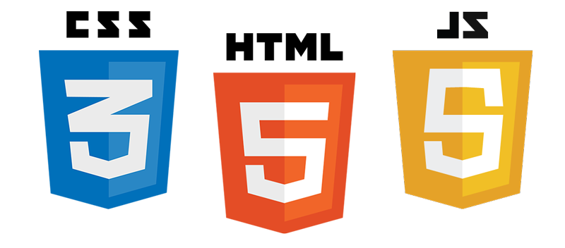

# Les langages du web

## HTML5 + CSS3 + JS5 + SVG

- HTML5 est un langage à balises, qui fait partie d'une famille de langages dont les autres membres sont XML, SVG, MathML, ...!!
  Son support est un fichier texte avec extension `html` et au type MIME `text/html`.
- CSS3 est un langage de description de données structurées en arbre.!!
  Son support est un fichier texte avec extension `css` et au type MIME `text/css`. Il peut être aussi inclus directement dans une page web avec la balise ``

* * *

- ``
  + ``

## Balises fondamentales

- Balises de base
  + `
` la conteneur de base _block_ ([exemple](http://dabblet.com/gist/3e141d95513b27a4bbc5))
  + `` la conteneur de base _inline_ ([exemple](http://dabblet.com/gist/e586030952be736189e7))
- Balises de liens
  + `` pour inclure une image ([exemple](http://dabblet.com/gist/043e30ff1c328063f5f6))
  + `<a>` pour créer un lien ([exemple](http://dabblet.com/gist/59f53ff244a7c4982c2a))

## Balises pour structurer et formater un texte

- `<h1>` – `<h6>` les titres de niveaux 1 à 6 ([exemple](http://dabblet.com/gist/c5bfa781fd194db1dc8f))
- `
` un paragraphe ([exemple](http://dabblet.com/gist/0177f3cde7ffb2174ae1))
- ` ` passage à la ligne (_void_) ([exemple](http://dabblet.com/gist/a86f0e04e41e090da387))
- `
` ligne horizontale (_void_) ([exemple](http://dabblet.com/gist/e5c145cb3b3c773e5481))
- `<b>, <strong>` gras (important) ([exemple](http://dabblet.com/gist/5f975b8a92f83ecf614a))
- `<i>, <em>` italique (mise en valeur) ([exemple](http://dabblet.com/gist/f09a54294a3f274a5a5d))
- `<s>, <del>` barré (supprimé) ([exemple](http://dabblet.com/gist/70dfb1bd81eb92726a2b))
- `<u>, <ins>` souligné (inséré) ([exemple](http://dabblet.com/gist/11dcc9a5c7a4846bc5e2))
- `<mark>` marqué ([exemple](http://dabblet.com/gist/2d4a26b1c8887f0c56f8))
- `<small>` petit ([exemple](http://dabblet.com/gist/89dd36e9ab023ef2316d))
- `, ` indice et exposant ([exemple](http://dabblet.com/gist/18c9d9b7764d2d76850c))

## Balises pour créer des listes

- `<ul>` liste non numérotée ([exemple](http://dabblet.com/gist/218cf243d7f641066514))
- `<ol>` liste numérotée ([exemple](http://dabblet.com/gist/6ff5feac49280b9dde46))
  + `<li>` élément d'une liste

* * *

- `<dl>` liste de définitions ([exemple](http://dabblet.com/gist/e4339f1e49810aa5632c))
  + `<dt>` terme à définir
  + `<dd>` la définition du terme

## Balises pour des textes spéciaux

- `<q>` entre guillemets
- `<blockquote>` partie en retrait
- `<cite>` référence de citation ([exemple](http://dabblet.com/gist/e50bd8db86a98f9fb362))

* * *

- `<pre>` partie <q>préformaté</q> ([exemple](http://dabblet.com/gist/a268c4b75e30dbba0d22))
- `<code>` code source ([exemple](http://dabblet.com/gist/b0f7cae2b782da1cd8fd))
- `<kbd>` touche de clavier
- `<var>` variable

## Balises sémantiques

- `<main>` partie principale de la page ([exemple](http://dabblet.com/gist/5dfe603bf3231c7672a0))
- `<article>` article
- `<section>` section
- `<aside>` à côté
- `<nav>` partie contenant plusieurs liens de navigation
- `<footer>` bas de page, de section, d'article, ...
- `<header>` en tête de page, de section, d'article, ...
- `<adress>` adresse
- `<time>` moment (heure et/ou date)

## Balises pour la création des tables

Il ne faut utiliser les tables que pour faire des tables, et non pour la mise en page !

- `<table>` table
  - `<thead>` l'en-tête
    - `<tr>` ligne d'en-tête
      - `<th>` titre de colonne
  - `<tfoot>` le bas de la table
    - `<tr>` ligne de bas
      - `<td>` cellule de bas
  - `<tbody>` corps de la table
    - `<tr>` ligne de la table
      - `<td>` cellule avec des données

([exemple](http://dabblet.com/gist/d54682f7a7715c731bfd))

Pour créer une table vous pouvez utiliser [www.tablesgenerator.com](http://www.tablesgenerator.com/html_tables).!!
Mais malheureusement il ne génère pas `<thead>`, `<tfoot>` et `<tbody>`.

# Les caractères spéciaux

- `&#946;` représente le caractère de code 946 en base 10 (β).
- `&#x3B2;` représente le caractère de code 3B2 en base 16 (β).
- `&beta;` représente le caractère _beta_ en HTML (β).

## quelques exemples

- `&amp;` = &
- `&lt;` et `&gt;` = < et >
- `&laquo;` et `&raquo;` = « et »
- `&dash;`, `&ndash;` et `&mdash;` = ‐, – et —
- `&nbsp;` = (espace insécable)
- `&euro;` = €
- `&copy;` = ©
- `&reg;` = ®
- ... pour une liste complète voir [w3.org](http://dev.w3.org/html5/html-author/charref)
