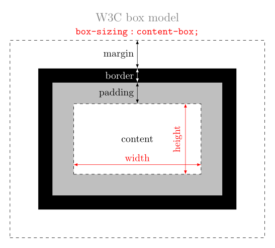
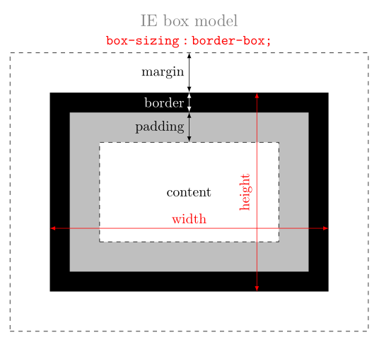

# CSS3

## Exemple

~~~~~~~
/* les titres de niveau 1 */

h1 {
  color:red;
}

/* les 
 de classe "message" */

div.message {
  background-color: #fee;
  text-align: center;
  padding: 1em;
  font-weight: bold;
}
~~~~~~~

## Où mettre le code CSS ?

Par ordre de préférence (et inversement à la priorité)

- Dans un fichier externe avec extension `css` qu'on inclut dans le html avec la balise `<link>`:
  `<link rel="stylesheet" href="monstyle.css">`
- Dans une balise `
  ~~~~~~~

- Directement dans un élément:
  `...`

[[exemple]](http://codepen.io/ktzanev/pen/vEvvpO?editors=110)

# Sélecteurs

Une règle CSS s'écrit de la forme :

~~~~~~~
sélecteur {
  propriété1: valeurs1;
  propriété2: valeurs2;
  ...
  propriétéN: valeursN;
}
~~~~~~~
{: class="html"}

## Sélecteurs de base

- `*` : _sélecteur universel._ Correspond à tout élément. [[example]](http://codepen.io/ktzanev/pen/ogJJEv?editors=110)
- `E` : _sélecteur de balise._ Correspond à tout élément E (c.à.d., un élément de type E). [[example]](http://codepen.io/ktzanev/pen/PwXXQb?editors=110)
- `E F` : _sélecteur de descendant._ Correspond à tout élément F qui est un descendant de l'élément E.
- `E > F` : _sélecteur d'enfant._ Correspond à tout élément F qui est un enfant de l'élément E. [[example]](http://codepen.io/ktzanev/pen/pvqqaL?editors=110)
- `E + F` : _sélecteur d'adjacence._ Correspond à tout élément F immédiatement précédé par un élément E. [[example]](http://codepen.io/ktzanev/pen/gbZZew?editors=110)
- `E[foo]` : _sélecteur d'attribut._ Correspond à tout élément E avec l'attribut « foo » (quelle qu'en soit sa valeur).
- `E[foo="boo"]` : _sélecteur valeur d'attribut._ Correspond à tout élément E dont l'attribut « foo » a exactement la valeur « boo ». [[example]](http://codepen.io/ktzanev/pen/yyGGjj?editors=110)
- `.foo` : _sélecteur de classe._ Correspond à tout élément qui est de classe « foo ». C'est identique à `[class~="foo"]`. [[example]](http://codepen.io/ktzanev/pen/JowwBQ?editors=110)
- `#foo` : _sélecteur d'ID._ Correspond à l'élément dont l'id est « foo ». [[example]](http://codepen.io/ktzanev/pen/gbZZBg?editors=110)

## Pseudo-classes

commencent par `:`

- `:not(selector)` les éléments ne correspondants pas au « selector »
- `:hover` quand le curseur survole l'élément
- `:visited` après que le liens soit visité (ne s'applique qu'aux `<a>`).
- `:first-child`, `:last-child` premier ou dernier enfants
- `:nth-child(n)` n-ème enfant (n=1,2,..., even, odd).
- `:empty` les balises vides

[[example]](http://codepen.io/ktzanev/pen/wBRVvM?editors=110)

## Pseudo-éléments

commencent par `::`

- `::first-line` la première ligne
- `::first-letter` la première lettre
- `::before`, `::after` permet de rajouter du texte au début et à la fin de l'élément.
- `::selection` la partie sélectionnée par l'utilisateur

[[example]](http://codepen.io/ktzanev/pen/xbmvZy?editors=110)

## Combinaison de sélecteurs

- On peut combiner plusieurs sélecteurs, comme par exemple
  `div.main > p:first-child:not(:empty)`
- On peut appliquer un style à plusieurs sélecteurs en les séparant de virgules

  ~~~~~~~
  div#one, span.test, img:hover {
    cursor: pointer;
  }
  ~~~~~~~

## Priorités

L'ordre des priorité (de plus important vers le moins important) :

- Les propriétés avec `!important`
- Les propriétés dans l'attribut `style` de l'élément
- Les sélecteurs avec le plus d'id
- Les sélecteurs avec le plus d'attributs et classes
- Les sélecteurs avec le plus d'éléments
- Les sélecteurs qui sont dans la balise `<style>`
- La dernière propriété dans l'ordre

[[exemple]](http://codepen.io/ktzanev/pen/vEvvpO?editors=110)

# Propriétés

Nous avons déjà vu plusieurs exemples de propriétés.

Il y a deux types:

- simple : `color:red;`
- multiple: `border: 1px solid red;`, qui est raccourcie de trois propriétés `border-width`, `border-style` et `border-color`.!!
Attention : ces trois propriétés sont aussi des raccourcis ! Par exemple `border-width` peut être décomposé en `border-top-width`, `border-right-width`, `border-bottom-width` et `border-left-width`.

Vous pouvez voir les propriétés disponibles ici [Mémento CSS](http://openclassrooms.com/courses/apprenez-a-creer-votre-site-web-avec-html5-et-css3/memento-des-proprietes-css) ou ici [CSS sur w3schools](http://www.w3schools.com/css/default.asp).

## Hérédité

Il y a des priorités qui sont héritées par défaut et d'autre qui ne le sont pas.

- Par exemple `color` et `font-size` sont héritées.
- Mais `border`, `margin` et `padding` ne le sont pas.

On peut changer ce comportement avec les valeurs `inherit` (pour forcer l'héritage) ou `initial` (pour arrêter l'héritage et forcer la valeur initiale). [[exemple]](http://codepen.io/ktzanev/pen/gbZqLX?editors=110)

## Unités

- `px` : en pixel (pas vraiment pour les téléphones ~ 96 ppi)
- `cm`, `mm`, `in`, `pt`, `pc` : fonctionne aussi, mais ...
- `em` : égale à la taille de la police (par défaut 16px). Il y a aussi `rem` qui est relatif à la police du `<html>`.
- `vw`, `vh` : 1/100 de la largeur et de la hauteur de l'écran. Il y a aussi `vmin` et `vmax`.
- `%` : relativement à la valeur du parent.
- `calc` : on peut utiliser cette fonction pour faire des calculs, par exemple `width: calc(50% - 1em);`.

Pour plus d'information voir [W3C : unités](http://www.w3.org/Style/Examples/007/units.fr.html).

# Box model

{:style="max-width:42%"} {:style="max-width:42%"}

- `box-sizing: content-box` (par défaut)
- `box-sizing: border-box`

## Type de boites

- `display:block` : comme un `div`
- `display:inline` : comme un `span`
- `display:inline-block` : comme un `img`
- `display:none` : n'est pas affiché
- Il y a d'autres, mais plus complexes, comme par exemple le récent `display:flex` ...

## Positionnement

- `position:static` : est le positionnement par défaut.
- `position:relative` : relativement à la position par défaut (sa place reste réservée). A utiliser avec `top`, `right`, `bottom` ou `left`.
- `position:absolute` : placé de façon absolu par rapport au premier parent qui n'est pas « static » (il ne prend pas de place).
- `position:fixed` : fixé par rapport à l'écran.
- Le positionnement « flottant », à voir par exemple [ici](http://openweb.eu.org/articles/initiation_float/).

[[exemple]](http://codepen.io/ktzanev/pen/XJovMB?editors=110)

